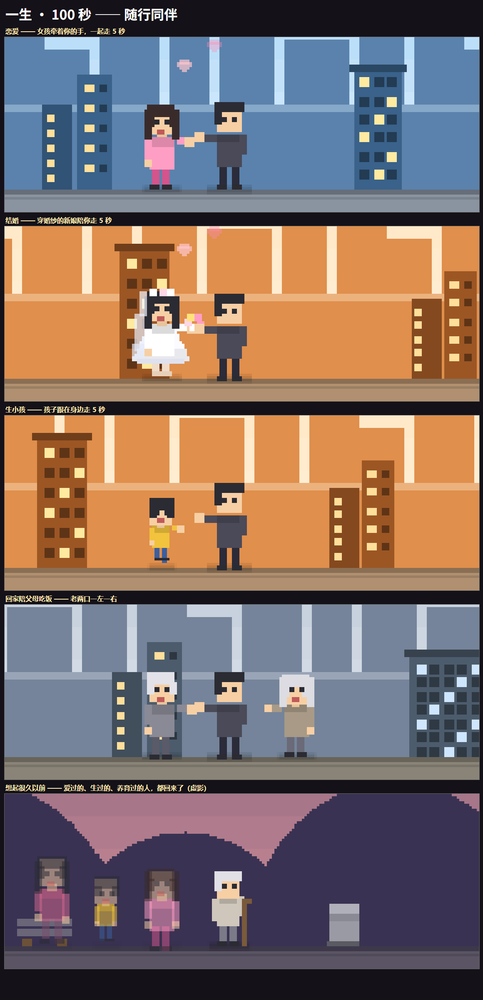

# 一生 · 100 秒

一个把「一辈子」压缩进 100 秒的像素风反应类网页小游戏。

小人从天上掉下来（出生），一路向右走，48 件「人生该做的事」劈头盖脸砸过来。
你来得及做完多少，就是这一生的完成度。

## 玩

直接用浏览器打开 `life-game.html` 即可，**单文件、零外部依赖、无需联网、无需构建**。

也可以起个本地服务：

```bash
python -m http.server 8000
# 打开 http://localhost:8000/life-game.html
```

> 首次点击画面后才会出声（浏览器要求用户手势才能启动音频）。

## 玩法

五种交互轮着来，难度越到后面越挤（事件窗口从 5 秒压到约 3 秒）：

| 交互 | 说明 |
|---|---|
| 点 | 点掉正在横向移动的物体 |
| 连点 | 在窗口内快速点够次数 |
| 按住 | 按住不放，撑到进度条满 |
| 拖拽 | 把物体拖进虚线方框 |
| 选择 | 从三个选项里挑「社会标准答案」 |

事件覆盖出生 / 童年 / 少年 / 青年 / 而立 / 中年 / 老年 / 暮年八个阶段：喝第一口奶、抓周、
写作业、广播体操、高考、投简历、面试、通宵加班、攒首付、买房、结婚、抱起新生儿、
还房贷、辅导作业、应酬敬酒、体检报告、送别父母、办退休、跳广场舞、按时吃药、
看一次夕阳、给儿女打个电话……

**结尾**：走到墓碑前，8 张卡片漂在面前——爱人、孩子、父母、事业、钱、自由、看过的夕阳、
没说出口的话。**只能带走一样**，其余当场散掉，那一样刻在墓碑上。最后按完成率给 8 档评价。

## 技术

全部美术、音乐、人声都是**代码程序化生成**，仓库里没有任何素材文件。

- **像素渲染**：480×270 世界画布，整数倍放大到主画布，`imageSmoothingEnabled = false`
  保住像素感；中文文字在主画布用逻辑坐标绘制，所以像素世界与清晰字体可以共存。
- **图标**：32 个 8×8 字符画 + 调色板，`wpx()` 是唯一的绘制原语。
- **场景**：8 个主题（粉产房 → 蓝天童年 → 灰色中年 → 橙色夕阳 → 紫色暮年），
  天空分带渐变 + 云 + 日出/夕阳 + 远中近三层视差，城市天际线与圆弧山丘交替。
- **音乐**：Web Audio 实时合成的 8bit 音序器，32 步、和声进行 Am–F–C–G、
  五声音阶琶音、噪声踩镲；**BPM 从 148 一路飙到 218**，越来越急。
  小人开口是 `gibberish()` 合成的含糊尖锐人声。
- **时间轴**：以每个事件的真实年龄为控制点做分段线性插值 `ageAt(t)`，
  年龄、场景阶段、事件三者严格对齐，越老时间过得越快。
- **小人动画**：`heroAnim` 单槽状态机 → `heroPose()` 换算成
  位移 / 缩放 / 倾斜 / 手臂 / 表情五组参数 → 喂给像素绘制。
  12 种通用动作（伸手、出拳、咬牙硬撑、后仰拉、托腮、小跳、转体欢呼、踉跄、晕眩…），
  做动作时世界滚动降到 32%，形成「停顿一拍」的节奏。
- **任务专属结果动画**：每个任务都配了一对**自己的**成功 / 失败演出，
  共 96 套。做成了一层 `EVFX` 特效系统：

  - 18 个「配方」复用同一套运动，靠参数拉开差异 ——
    `R_pop`（弹起）`R_throw`（抛出）`R_drop`（落地+碎片散落）`R_rings`（声波扩散）
    `R_meter`（进度条）`R_stack`（层层堆叠）`R_grow`（生长）`R_crack`（碎裂）
    `R_two`（两物相撞）`R_swarm`（成群围上）`R_weather`（风雨云雪）
    `R_card`（落进手里）`R_marks`（依次盖章）`R_rise`（升空）`R_steps`（脚印）
    `R_arrow`（升降箭头）`R_zzz`（睡着）`R_phone`（声波电话）
  - 关键任务单独手写物理演出，例如「打疫苗」「背书包」
  - 每个特效分两层绘制：`draw()` 走**像素世界层**（跟场景一起被放大），
    `overlay()` 走**主画布**画中文小字（保持清晰）
  - 16 种挂在小人身上的临时状态 `heroAura`：免疫护盾、病气、睡意、怒气、
    汗、心碎、金币、肌肉、心律…（`drawHeroAura`）
  - 几例：

    | 任务 | 成功 | 失败 |
    |---|---|---|
    | 打疫苗 | 针筒推药 + 蓝色护盾从脚下升起 | 病毒成群落下来、绿色病气泡上冒 |
    | 背书包 | 书包落上肩、肩带收紧 | 书包砸在地上、书本四散 |
    | 按时吃药 | 药片一颗颗升起 | 药撒了一地、滚开 |
    | 体检报告 | 三项全绿对勾 | 一排红色下坠箭头 |
    | 看夕阳 | 夕阳下沉、橙光铺地、快门一闪 | 乌云压过来把太阳盖住 |
    | 努力呼吸 | 平稳的心电波形 | 波形乱跳、末端转红 |

- **随行同伴**：光有特效还不够——人生里真正重要的事，几乎都不是一个人做的。
  所以 48 件事里有 22 件成功后，会**有人陪你一起往前走 5 秒**：

  

  - `mates[]` 是一个同伴队列（最多 5 个），每个同伴自带进场（从右侧跑进队伍）、
    并肩行走、退场淡出三段；**牵手**是双向的——小人和同伴各自把内侧那只手伸出来。
  - 13 种同伴：`girl` 恋人 / `crush` 暗恋的人 / `bride` 新娘（头纱+头花+捧花）/ `wife` 老伴 /
    `mom` `dad` 父母 / `oldmom` `olddad` 老年父母 / `boy` 朋友同学 / `mate` 同事（领带+公文包）/
    `dancer` 舞伴 / `child` 孩子（按比例放大头，才像小孩）/ `pet` 狗。
  - 会**自动换人**：`girl` 出现时上一任 `girl` 快速退场；`bride` 一出现，恋人先让位；
    `child` 一出现，新娘退场——读起来就是「谈恋爱 → 结婚 → 有孩子」这一条线。
  - 细节：恋爱/结婚类头顶飘心；「送别父母」的两位老人会**往左走远**（`exit:'out'`）；
    「想起很久以前」叫回三个**半透明的虚影**（爱人、孩子、母亲），跟在拄拐的老人身后。
  - 「恋爱」42.4s 开，「结婚」47.5s 开——女孩刚好走完她的 5 秒，新娘就上场了。

## 难度标定

用 Node 无头仿真 + 拟人点击模型跑满全程测得（仿真瞄准是完美的，真人会更低）：

| 手速 | 完成 | 评价 |
|---|---|---|
| 4 次/秒以上 | 46/48 | 人生赢家 |
| 约 2.9 次/秒 | 38/48 | 体面 |
| 约 2.2 次/秒 | 34/48 | 及格 |

## 调试入口

正常游玩用不到，调参时很方便：

```
life-game.html?t=30                  跳到第 30 秒
life-game.html?screen=menu           直接看开始页
life-game.html?screen=final          直接看临终抉择
life-game.html?screen=result         直接看结算页
life-game.html?&mute                 静音
life-game.html?t=30&anim=lunge&ap=0.4      定格在小人某个动作的某个进度
life-game.html?fx=vacOk&ap=0.8             定格某个任务的成功动画
life-game.html?fx=vacOk&ok=0&ap=0.8        强制看失败版
life-game.html?mate=girl&ap=2.6            叫一个女孩来陪着走（定格）
life-game.html?mate=girl,child&ap=2        叫两个
life-game.html?t=82.2&mate=girl,child,mom&g=1&ap=3   三个半透明虚影
```
